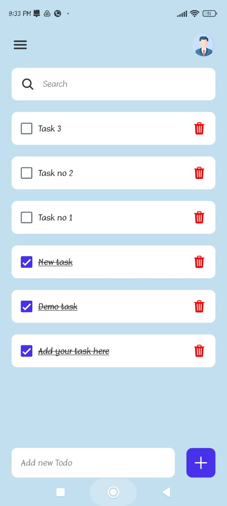
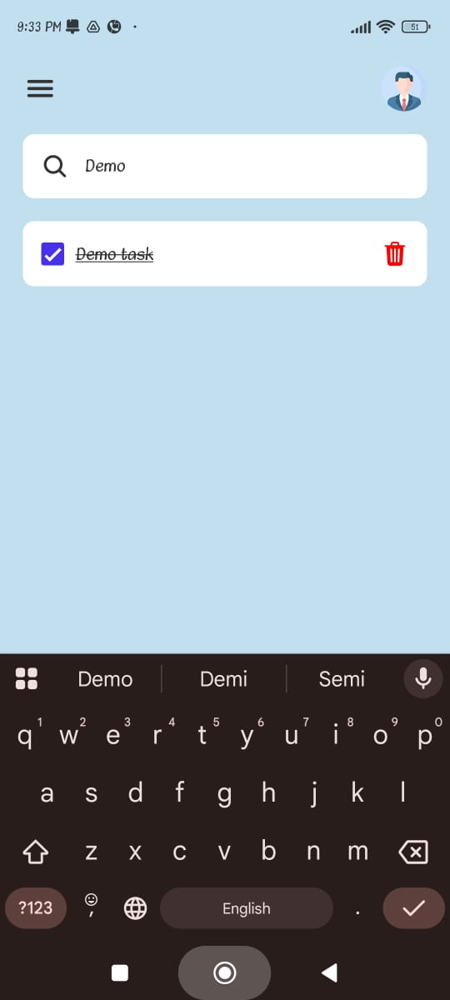

# 📝 Todo App

A simple and clean Todo App built with **React Native** and **Expo** to help you stay organized and manage your daily tasks efficiently.
## App Screenshot :
<p>
    
    
</p>

***

## ✨ Features

* **Add Tasks:** Quickly add new tasks to your list.
* **Mark as Complete:** Tap to mark tasks as completed.
* **Delete Tasks:** Easily remove tasks you no longer need.
* **Clean UI:** A user-friendly and intuitive interface.
* **Cross-Platform:** Runs on both Android and iOS thanks to React Native & Expo.

***

## 📥 Download

You can download the latest APK for Android directly from the link below.

**[Download the App (APK)](https://drive.google.com/file/d/1r51_760hkSriyDtsKmL78p6jfykQKlgg/view?usp=drivesdk)**


***

## 🚀 Tech Stack

* **React Native:** A framework for building native apps using React.
* **Expo:** A platform for making universal React applications.
* **TypeScript:** The programming language used to build the app.

***

## 🛠️ Setup and Installation

To run this project locally, follow these simple steps:

1.  **Clone the repository:**
    ```bash
    git clone [https://github.com/Himangshuroy101/TodoApp-React-Native.git](https://github.com/Himangshuroy101/TodoApp-React-Native.git)
    ```

2.  **Navigate to the project directory:**
    ```bash
    cd TodoApp-React-Native
    ```

3.  **Install dependencies:**
    ```bash
    npm install
    ```

4.  **Run the app:**
    ```bash
    npx expo start
    ```
    This will open the Expo DevTools in your browser. You can then run the app on an Android emulator/device or an iOS simulator/device using the Expo Go app.

***

## 📬 Contact

Connect With Me –[@Linkedin](https://www.linkedin.com/in/himangshuroy101/) – himangshuroy05@gmail.com
